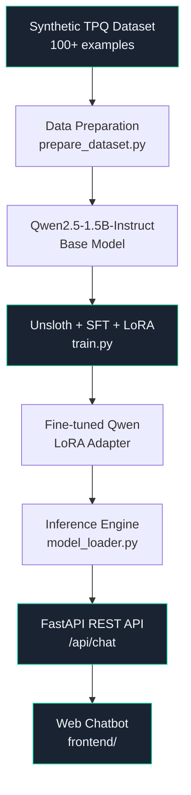

# TPQ AI Assistant

<div align="center">

**Qwen SFT with Unsloth & REST API**

*End-to-end AI/LLM portfolio project — from dataset to web chatbot*

[](https://www.python.org/)
[](https://huggingface.co/Qwen/Qwen2.5-1.5B-Instruct)
[](https://github.com/unslothai/unsloth)
[](https://fastapi.tiangolo.com/)
[](LICENSE)

</div>

---

## Overview

**TPQ AI Assistant** adalah chatbot web yang menjawab pertanyaan seputar administrasi **Taman Pendidikan Al-Quran (TPQ)**. Project ini dibangun sebagai **portfolio AI/LLM end-to-end** yang mendemonstrasikan seluruh pipeline dari dataset hingga deployment.

> ⚠️ **Project ini berdiri sendiri** dan tidak terintegrasi dengan sistem administrasi TPQ mana pun.

---

## Project Objective

Mendemonstrasikan kemampuan **end-to-end LLM engineering**:

```
Dataset → Qwen → SFT → Unsloth → LoRA → Fine-tuned Model → Inference → REST API → Web Chatbot
```

---

## Features

- 🤖 **Qwen2.5-1.5B-Instruct** sebagai base language model
- ⚡ **Unsloth** untuk fine-tuning yang lebih cepat dan hemat VRAM (2x lebih cepat, 70% lebih hemat)
- 🎯 **Supervised Fine-Tuning (SFT)** dengan 100+ synthetic examples domain TPQ
- 🔧 **LoRA / PEFT** — parameter-efficient fine-tuning, hanya ~1% parameter yang ditraining
- 🚀 **FastAPI REST API** dengan automatic Swagger documentation
- 💬 **Web Chatbot** dark-mode modern dengan vanilla HTML/CSS/JS
- 📊 **Evaluation framework** untuk membandingkan base model vs fine-tuned model

---

## Architecture



---

## Technology Stack

### AI / ML
| Library | Role |
|---------|------|
| Python 3.11+ | Core language |
| `unsloth/Qwen2.5-1.5B-Instruct` | Base language model |
| Unsloth | Efficient fine-tuning framework |
| Hugging Face Transformers | Model loading & tokenization |
| TRL (`SFTTrainer`) | Supervised fine-tuning |
| PEFT | LoRA implementation |
| PyTorch | Deep learning backend |

### Backend
| Library | Role |
|---------|------|
| FastAPI | REST API framework |
| Uvicorn | ASGI server |
| Pydantic | Request/response validation |

### Frontend
| Technology | Role |
|-----------|------|
| HTML5 | Structure |
| Vanilla CSS | Dark glassmorphism styling |
| Vanilla JavaScript | Chat interaction logic |

---

## Key Concepts Explained

### Qwen
**Qwen (千问)** adalah keluarga large language model yang dikembangkan oleh Alibaba Cloud. Project ini menggunakan **Qwen2.5-1.5B-Instruct** — model instruction-following dengan 1.5 miliar parameter yang optimal untuk fine-tuning dengan resource GPU terbatas.

### Supervised Fine-Tuning (SFT)
**SFT** adalah metode training yang mengajarkan model menggunakan pasangan instruksi-respons. Model belajar dari contoh-contoh format `user → assistant` untuk menghasilkan respons yang sesuai domain tertentu — dalam hal ini, administrasi TPQ.

### Unsloth
**Unsloth** adalah library yang mengoptimasi proses fine-tuning LLM menjadi:
- **2x lebih cepat** dibanding implementasi standar
- **70% lebih hemat VRAM** melalui custom CUDA kernels dan optimasi memory
- Memungkinkan fine-tuning model besar pada GPU konsumer (RTX 3060, T4)

### LoRA (Low-Rank Adaptation)
**LoRA** adalah teknik parameter-efficient fine-tuning yang **tidak mengubah** semua bobot model. Sebaliknya, LoRA menambahkan matriks rank-rendah yang kecil pada layer tertentu. Hasilnya:
- Hanya **~1% parameter** yang perlu ditraining
- Output berupa **adapter file** kecil (~10-50 MB) bukan salinan model penuh
- Dapat digabungkan kembali dengan base model saat inference

---

## Project Structure

```
tpq-ai-assistant/
│
├── data/
│   ├── raw/
│   │   └── dataset.jsonl        # 100+ synthetic Q&A examples
│   ├── expand_dataset.py        # Helper to expand dataset to 300+
│   ├── train.jsonl              # Generated: 80% split
│   ├── validation.jsonl         # Generated: 10% split
│   └── test.jsonl               # Generated: 10% split
│
├── training/
│   ├── config.py                # All hyperparameters (edit here)
│   ├── prepare_dataset.py       # Validate, split & save dataset
│   └── train.py                 # Unsloth + SFT + LoRA training
│
├── inference/
│   ├── model_loader.py          # Load model & generate responses
│   └── chat.py                  # Interactive CLI chat
│
├── evaluation/
│   ├── test_questions.json      # 30 test questions
│   └── evaluate.py              # Base vs fine-tuned evaluation
│
├── api/
│   ├── main.py                  # FastAPI app + lifespan model loading
│   ├── routes/
│   │   └── chat.py              # POST /api/chat endpoint
│   └── schemas/
│       └── chat.py              # Pydantic request/response models
│
├── frontend/
│   ├── index.html               # Chat interface
│   ├── style.css                # Dark glassmorphism theme
│   └── script.js                # Chat logic & API calls
│
├── models/
│   └── README.md                # Model output directory guide
│
├── requirements.txt             # All dependencies
├── requirements-training.txt    # Training-only dependencies
├── requirements-inference.txt   # Inference & API dependencies
├── .env.example                 # Environment variable template
└── README.md
```

---

## Dataset

### Format
Dataset menggunakan **JSONL chat format** yang kompatibel dengan Qwen2.5 chat template:

```json
{
  "messages": [
    {
      "role": "user",
      "content": "Bagaimana cara melihat nilai anak?"
    },
    {
      "role": "assistant",
      "content": "Wali santri dapat melihat nilai anak melalui menu Nilai setelah login ke sistem."
    }
  ]
}
```

### Categories (12 kategori)
| # | Kategori | Contoh Topik |
|---|----------|-------------|
| 1 | Informasi umum TPQ | Apa itu TPQ, cara daftar, usia minimum |
| 2 | Absensi santri | Melihat kehadiran, batas alfa, izin |
| 3 | Nilai santri | Rapor, komponen nilai, kenaikan kelas |
| 4 | Pembayaran SPP | Metode bayar, batas tanggal, riwayat |
| 5 | Pengumuman | Melihat pengumuman, notifikasi |
| 6 | Data santri | Profil, tingkat kelas, nomor induk |
| 7 | Wali santri | Ubah kontak, lebih dari satu anak |
| 8 | Ustadz/Ustadzah | Kontak pengajar, kualifikasi |
| 9 | Admin | Kelola jadwal, tambah santri, buat pengumuman |
| 10 | Jadwal belajar | Jam mulai, hari belajar, jadwal Ramadhan |
| 11 | Aturan TPQ | Pakaian, sanksi, perlengkapan |
| 12 | Fitur sistem | Login, cetak laporan, akses mobile |

### Split
| Set | Jumlah | Rasio |
|-----|--------|-------|
| Train | ~80 | 80% |
| Validation | ~10 | 10% |
| Test | ~10 | 10% |

> Dataset dibuat sintetis — tidak menggunakan data pribadi santri asli.

---

## Installation

### 1. Clone Repository

```bash
git clone https://github.com/username/tpq-ai-assistant.git
cd tpq-ai-assistant
```

### 2. Create Virtual Environment

```bash
python -m venv .venv

# Windows
.venv\Scripts\activate

# Linux/Mac
source .venv/bin/activate
```

### 3. Install Dependencies

**Untuk training (GPU required):**
```bash
pip install -r requirements-training.txt
```

**Untuk inference & API saja:**
```bash
pip install -r requirements-inference.txt
```

### 4. Setup Environment Variables

```bash
cp .env.example .env
# Edit .env sesuai kebutuhan
```

---

## Usage

### Step 1: Prepare Dataset

```bash
python training/prepare_dataset.py
```

Output:
```
Dataset preparation completed.

  Total: 100
  Train: 80
  Validation: 10
  Test: 10
```

---

### Step 2: Fine-Tuning

> ⚠️ **GPU Required**: NVIDIA GPU dengan minimal 8GB VRAM (T4, RTX 3060, atau lebih tinggi).
> Training belum dijalankan pada repository ini karena keterbatasan hardware.

```bash
python training/train.py
```

Training pipeline:
1. Load `unsloth/Qwen2.5-1.5B-Instruct` dengan 4-bit quantization
2. Apply LoRA adapters (`r=16, alpha=16`)
3. Format dataset menggunakan chat template Qwen
4. Training dengan `SFTTrainer` (TRL)
5. Simpan adapter ke `./models/qwen-tpq-sft/`

**Training Configuration** (`training/config.py`):
```python
MODEL_NAME = "unsloth/Qwen2.5-1.5B-Instruct"
MAX_SEQ_LENGTH = 2048
LOAD_IN_4BIT = True
LORA_R = 16
LORA_ALPHA = 16
LEARNING_RATE = 2e-4
PER_DEVICE_TRAIN_BATCH_SIZE = 2
GRADIENT_ACCUMULATION_STEPS = 4
NUM_TRAIN_EPOCHS = 3
```

---

### Step 3: Model Inference (CLI)

```bash
python inference/chat.py
```

```
TPQ AI Assistant - Interactive Chat
------------------------------------
Anda: Bagaimana cara melihat nilai anak?

TPQ AI: Wali santri dapat melihat nilai anak melalui menu Nilai
         pada sistem administrasi setelah login. Nilai yang ditampilkan
         meliputi nilai harian, nilai ujian tengah semester, dan nilai
         ujian akhir semester.
```

---

### Step 4: Running FastAPI Server

```bash
uvicorn api.main:app --host 0.0.0.0 --port 8000
```

Server akan tersedia di:
- **Web Chatbot**: http://localhost:8000
- **API Docs (Swagger)**: http://localhost:8000/docs
- **Health Check**: http://localhost:8000/health

---

### Step 5: Evaluation

```bash
# Full evaluation (base model vs fine-tuned)
python evaluation/evaluate.py

# Generate manual scoring template only (no GPU needed)
python evaluation/evaluate.py --manual-only

# Evaluate fine-tuned model only
python evaluation/evaluate.py --finetuned-only
```

---

### Expanding the Dataset to 300+

```bash
# Generate expansion templates
python data/expand_dataset.py

# Edit draft file: data/raw/dataset_expansion_draft.jsonl
# Then merge into main dataset
python data/expand_dataset.py --merge

# Re-run data preparation
python training/prepare_dataset.py
```

---

## API Endpoints

### `GET /`
Serves the web chatbot frontend.

---

### `GET /health`
Health check endpoint.

**Response:**
```json
{
  "status": "healthy",
  "model": "qwen-tpq-sft"
}
```

---

### `POST /api/chat`
Send a message and receive an AI response.

**Request:**
```json
{
  "message": "Bagaimana cara melihat nilai anak?"
}
```

**Response:**
```json
{
  "response": "Wali santri dapat melihat nilai anak melalui menu Nilai setelah login ke sistem."
}
```

**Validation:**
- `message` wajib diisi (tidak boleh kosong)
- `message` maksimal 1000 karakter

**Error Responses:**
| Status | Kondisi |
|--------|---------|
| `422` | Pesan kosong atau terlalu panjang |
| `503` | Model belum di-load |
| `500` | Error saat generate response |

**Interactive Docs:** `http://localhost:8000/docs`

---

## Example Interactions

```
User:    "Kapan batas pembayaran SPP setiap bulan?"
AI:      "Batas pembayaran SPP adalah tanggal 10 setiap bulannya.
          Wali santri diharapkan melakukan pembayaran sebelum tanggal
          tersebut untuk menghindari keterlambatan."

User:    "Bagaimana cara mereset password?"
AI:      "Untuk mereset password, klik tombol Lupa Password di halaman
          login kemudian masukkan email atau nomor telepon yang terdaftar.
          Link reset password akan dikirimkan ke email atau SMS Anda."

User:    "Bagaimana cara membuat website?"
AI:      "Maaf, saya adalah TPQ AI Assistant yang fokus membantu
          pertanyaan terkait administrasi Taman Pendidikan Al-Quran (TPQ).
          Saya tidak dapat membantu pertanyaan di luar konteks TPQ."
```

---

## Hardware Requirements

### Training
| Component | Minimum | Recommended |
|-----------|---------|-------------|
| GPU VRAM | 8 GB | 16 GB+ |
| GPU | RTX 3060 / T4 | A100 / RTX 4090 |
| RAM | 16 GB | 32 GB+ |
| Storage | 10 GB | 20 GB+ |

> **Cloud Alternative**: Google Colab (T4, gratis) atau Kaggle (P100, gratis)

### Inference & API
| Component | Minimum |
|-----------|---------|
| GPU VRAM | 4 GB (4-bit quantized) |
| RAM | 8 GB |
| CPU-only | Possible but very slow |

---

## Results

> ⚠️ **Training Status**: Model belum ditraining karena keterbatasan hardware lokal.
> Hasil evaluasi akan diperbarui setelah training selesai pada GPU yang sesuai.

Evaluasi akan menggunakan framework di `evaluation/evaluate.py` yang membandingkan:

| Metrik | Base Model | Fine-tuned Model |
|--------|-----------|-----------------|
| In-domain relevance | - | - |
| Out-of-domain rejection | - | - |
| Response quality (1-5) | - | - |
| Instruction following | - | - |

---

## Limitations

1. **GPU Required for Training**: Fine-tuning membutuhkan NVIDIA GPU, tidak bisa dijalankan di CPU.
2. **Synthetic Dataset**: Dataset dibuat secara sintetis — tidak berdasarkan data TPQ nyata.
3. **Domain Limited**: Model dirancang khusus untuk administrasi TPQ; tidak cocok untuk domain lain.
4. **Small Model**: Qwen2.5-1.5B adalah model kecil; respons mungkin kurang detail dibanding model lebih besar.
5. **No RAG**: Versi pertama tidak menggunakan retrieval — semua pengetahuan dari fine-tuning.

---

## Future Improvements

- [ ] Expand dataset ke 300+ examples untuk training yang lebih baik
- [ ] Tambahkan RAG (Retrieval-Augmented Generation) dengan dokumen TPQ
- [ ] Export model ke GGUF format untuk deployment ringan via llama.cpp
- [ ] Tambahkan conversation history (multi-turn chat)
- [ ] Implementasi streaming response
- [ ] Tambahkan unit tests dan CI/CD pipeline
- [ ] Deploy ke cloud (HuggingFace Spaces, Railway, atau Render)
- [ ] Gunakan model lebih besar (Qwen2.5-7B) jika GPU memadai

---

## License

MIT License — see [LICENSE](LICENSE) for details.

---

<div align="center">

Built as an AI/LLM portfolio project demonstrating end-to-end LLM engineering.

**Dataset → Qwen → SFT → Unsloth → LoRA → Fine-tuned Model → Inference → REST API → Web Chatbot**

</div>
